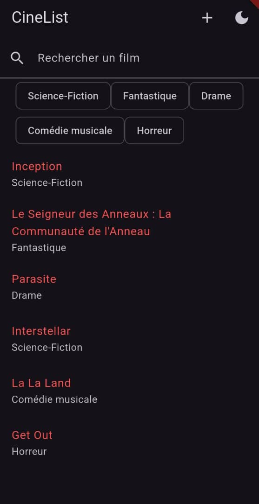

# 🎬 CineList

Application Flutter multi-écrans pour parcourir un catalogue de films, consulter leurs
détails et se constituer une watchlist personnelle.

Projet réalisé dans le cadre de l'exercice **« App multi-écrans avec navigation »**.

---

## ✨ Fonctionnalités

- **Catalogue de films** avec recherche par titre en temps réel et filtrage par genre
- **Carrousel « À l'affiche »** mettant en avant les films les mieux notés
- **Fiche détaillée** de chaque film (genre, année, note, synopsis), avec une
  animation d'affiche partagée depuis la liste
- **Watchlist personnelle** alimentée par un formulaire d'ajout
- **Formulaire validé** (titre, genre, note) avec messages d'erreur explicites
- **Thème clair / sombre** basculable depuis la barre d'application
- **Interface responsive** : liste verticale sur mobile, grille de 2 colonnes sur
  tablette et 3 colonnes sur grand écran ; les écrans de détail, d'ajout et de
  watchlist limitent leur largeur de lecture

---

## 📱 Captures d'écran

| Accueil (thème clair) | Accueil (thème sombre) | Détail d'un film |
| :---: | :---: | :---: |
|  |  |  |

---

## 🗺️ Écrans et navigation

La navigation est gérée par [`go_router`](https://pub.dev/packages/go_router).

Chaque route porte un **nom**, ce qui évite d'écrire les chemins à la main dans les
écrans : la navigation se fait avec `context.pushNamed(...)`.

| Route | Nom | Écran | Rôle |
| --- | --- | --- | --- |
| `/` | `accueil` | `HomeScreen` | Liste des films, recherche et filtres par genre |
| `/detail/:id` | `detail` | `DetailScreen` | Détail d'un film, reçoit l'`id` en paramètre de route |
| `/add` | `ajout` | `AddMovieScreen` | Formulaire d'ajout d'un film à la watchlist |
| `/watchlist` | `watchlist` | `WatchlistScreen` | Films ajoutés par l'utilisateur |

**Passage de paramètres** : depuis l'accueil, un appui sur une carte déclenche

```dart
context.pushNamed(Routes.detail, pathParameters: {'id': '${film.id}'});
```

et l'écran de détail relit la valeur avec `state.pathParameters['id']`.

---

## 🧩 Structure du projet

```
lib/
├── main.dart                       # Point d'entrée, MaterialApp.router et thème
├── data/
│   ├── movies_repository.dart      # Catalogue de films (source de données)
│   └── watchlist_repository.dart   # Watchlist en mémoire + valeurs par défaut
├── models/
│   └── movie.dart                  # Modèle Movie
├── router/
│   └── app_router.dart             # Routes nommées GoRouter
├── screens/
│   ├── home_screen.dart
│   ├── detail_screen.dart
│   ├── add_movie_screen.dart
│   └── watchlist_screen.dart
├── theme/
│   ├── app_theme.dart              # Thèmes clair et sombre
│   └── genre_style.dart            # Dégradé et icône propres à chaque genre
└── widgets/                        # Widgets réutilisables
    ├── movie_card.dart             # Carte d'un film dans une liste ou grille
    ├── movie_poster.dart           # Affiche générée à partir du genre
    ├── featured_movie_card.dart    # Grande carte du carrousel « À l'affiche »
    ├── genre_chip.dart             # Puce de genre, filtre ou étiquette
    ├── rating_stars.dart           # Notation en étoiles (demi-étoiles gérées)
    ├── rating_badge.dart           # Pastille compacte de note
    ├── section_header.dart         # Titre de section avec compteur
    ├── empty_state.dart            # Message de liste vide illustré
    └── fade_slide_in.dart          # Apparition en fondu décalée
```

**Séparation UI / données** : aucune donnée n'est écrite en dur dans les widgets.
Les films proviennent des repositories du dossier `data/`, et les écrans ne font
que les afficher ou transmettre la saisie de l'utilisateur.

**Affiches** : le catalogue ne fournit pas d'images, donc chaque affiche est générée
à partir du genre du film (dégradé, icône, initiales du titre). Deux films du même
genre partagent la même ambiance de couleur.

---

## 🛠️ Technologies

| Outil | Version |
| --- | --- |
| Flutter | 3.44.8 (canal stable) |
| Dart | 3.12.2 |
| `go_router` | ^17.5.0 |
| `cupertino_icons` | ^1.0.8 |

Le SDK Dart minimum requis est déclaré dans `pubspec.yaml` : `^3.12.2`.

---

## 🚀 Instructions de lancement

### Prérequis

- [Flutter SDK](https://docs.flutter.dev/get-started/install) 3.44 ou supérieur
- Un émulateur Android / simulateur iOS, ou un appareil physique connecté
- Vérifier que l'environnement est prêt :

```bash
flutter doctor
```

### Installation

```bash
# 1. Cloner le dépôt
git clone https://github.com/<ton-utilisateur>/cinelist.git
cd cinelist

# 2. Installer les dépendances
flutter pub get
```

### Lancer l'application

```bash
# Lister les appareils disponibles
flutter devices

# Lancer sur l'appareil de son choix
flutter run -d <device-id>
```

Exemples :

```bash
flutter run -d emulator-5554   # émulateur Android
flutter run -d chrome          # navigateur web
flutter run -d windows         # application de bureau Windows
```

Pendant l'exécution, dans le terminal :

- `r` — hot reload (recharge le code modifié)
- `R` — hot restart (nécessaire après un changement de thème ou de structure de widget)
- `q` — quitter

### Démarrer un émulateur Android

```bash
flutter emulators                              # lister les émulateurs
flutter emulators --launch <emulator-id>       # en démarrer un
```

### Générer un APK

```bash
flutter build apk --release
```

L'APK est produit dans `build/app/outputs/flutter-apk/app-release.apk`.

### Vérifier le code

```bash
flutter analyze   # analyse statique : aucun problème attendu
flutter test      # 5 tests : affichage, recherche, validation, watchlist
```

Les tests couvrent l'affichage du catalogue, le filtrage par la recherche, les deux
cas d'erreur du formulaire (champs vides et note non numérique) et l'enregistrement
d'un film dans la watchlist.

---
